# 1_laba
## 00_distance.py
### Условие 
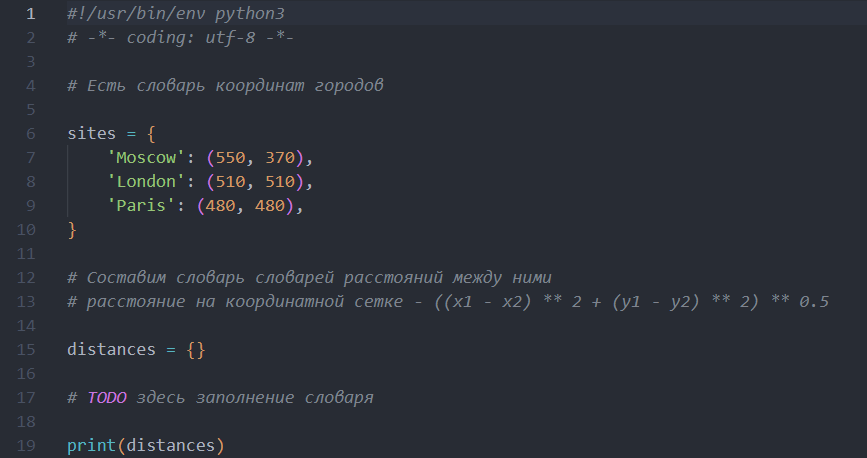
### Алгоритм
1. Создаём цикл `for` для города `c1` из списка городов
2. Создаём цикл `for` для города `c2`
3. Проверка на различие городов `c1` и `c2` и на то, что расстояние между ними ещё не было вычислено ранее.
4. Получаем координаты обоих городов
5. Вычисляем расстояние `s` между ними
6. Записываем найденное расстояние в словарь `distances` к паре городов `(c1, c2)`
7. Выводим расстояния между всеми парами городов.
### Результат
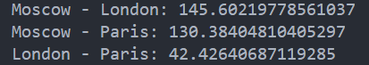
## 01_circle.py
### Условие 
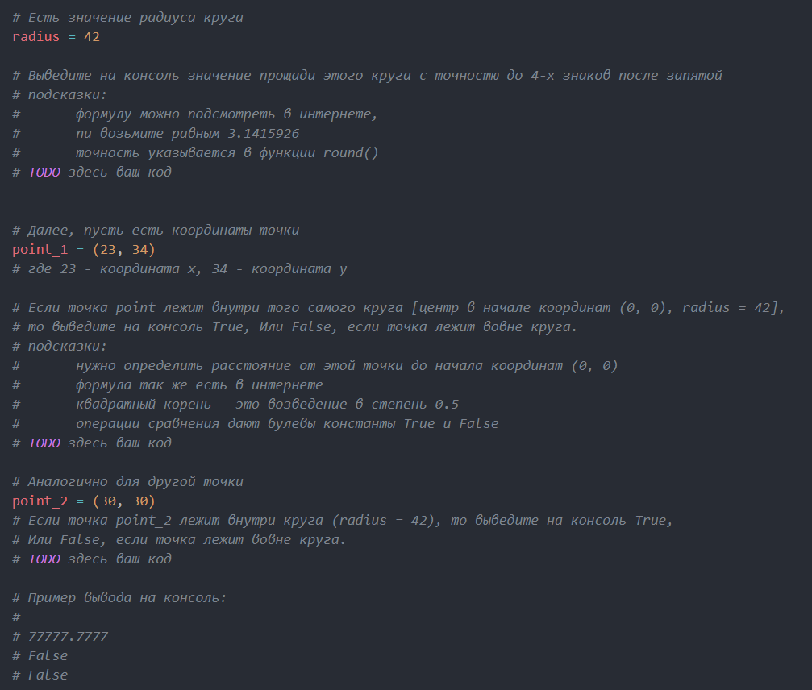
### Алгоритм 
1. Инициализируем число `pi = 3.1415926`, площадь круга `S = pi * radius**2`
2. Выводим значение `S` с точностью 4 цифр после запятой 
3. Инициализируем координаты точки 1. `x1 = 23` и `y1 = 34`
4. Инициализируем координаты точки 2. `x2 = 30` и `y2 = 30`
5. Создаём функцию `func`, которая проверяет то, находится ли точка внутри круга `(x**2 + y**2)**0.5 < radius`
6. Выводим результат
### Результат
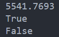
## 02_operations.py
### Условие 
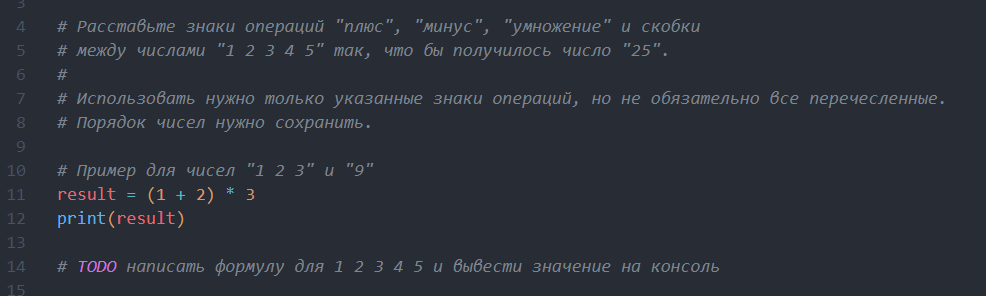
### Алгоритм 
1. Создаём переменную `asd`, в которой записываем выражение, при выполнении которого должно получится число 25
2. Выводим ответ
### Результат
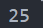
## 03_favorite_movies.py
### Условие
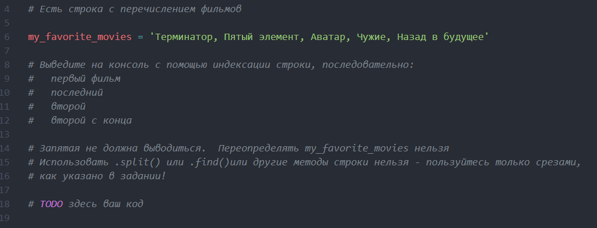
### Алгоритм
1. Подсчитываем количество букв (включая пробелы) в названиях фильмов, количество символов до/после названия фильма.
2. Для каждого фильма отдельно выводим результат
### Результат 
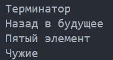
## 04_my_family.py
### Условие 
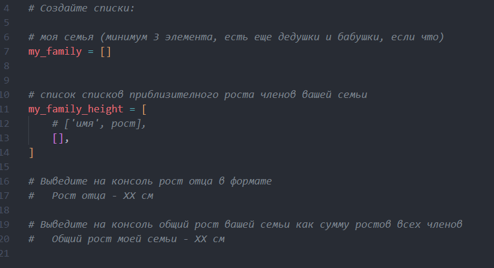
### Алгоритм
1. Создаём в `my_family_height` список роста у членов семьи
2. Выводим их рост
3. Выводим сумму ростов. Для этого нужно будет использовать цикл `for` для `x`, равный длине списка.
### Результат
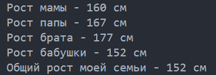
## 05_zoo.py
### Условие
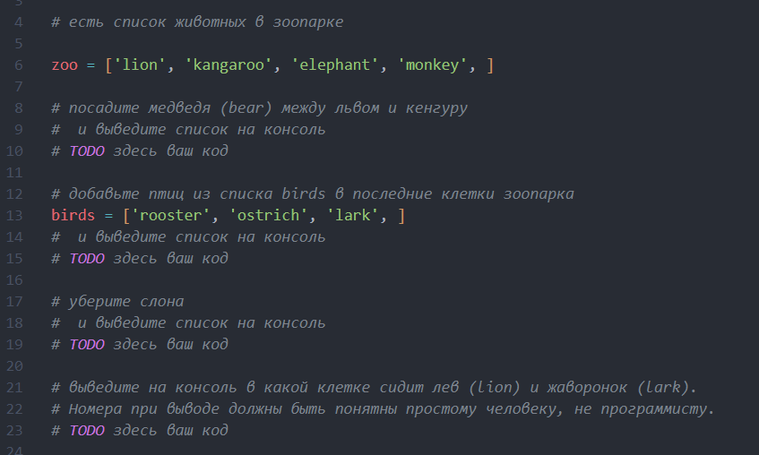
### Алгоритм
1. Чтобы добавить медведя на место 1 индекса, используем `zoo.insert` и выведем получившийся список
2. Чтобы к списку животных добавить список птиц, просто используем `+=`
3. Для удаления слона из списка используем `zoo.remove`
4. Для вывода номера клетки нужно к индеку добавить 1
### Результат
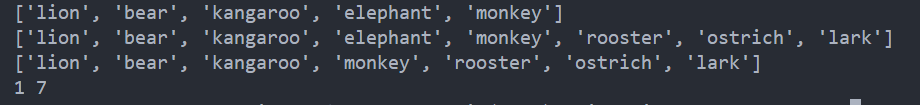
## 06_songs_list.py
### Условие
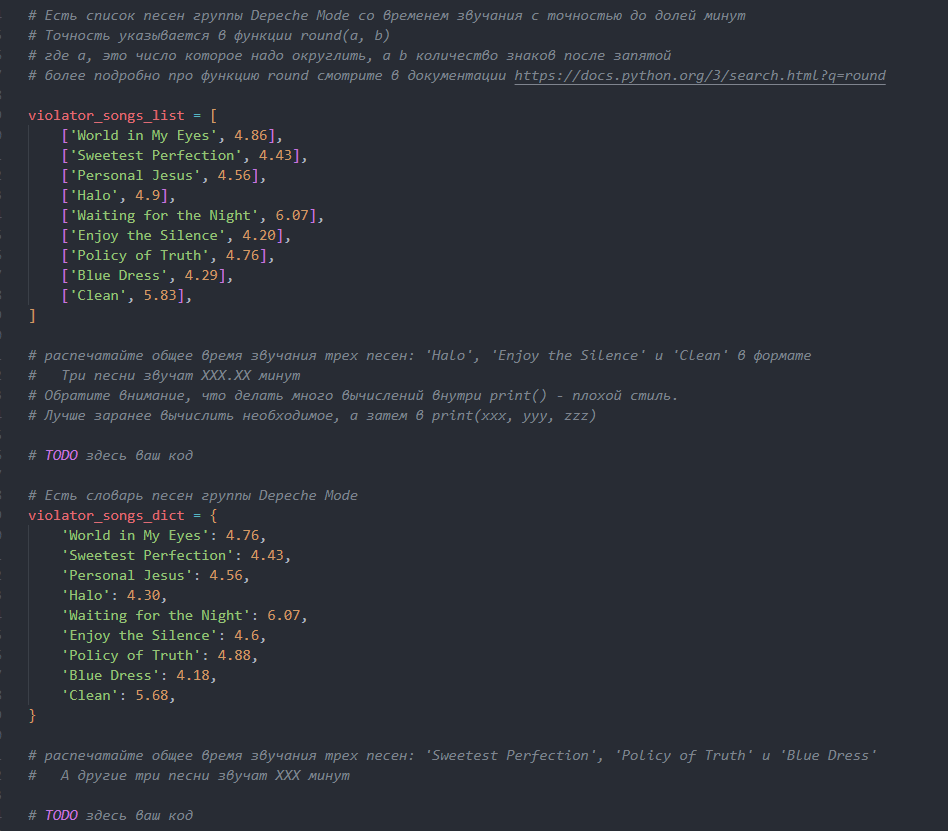
### Алгоритм
1. Инициализируем `summa1` и складываем значения трёх нужных песен по индексам [строка][столбец]
2. Выводим их на экран с точностью 2 цифры после запятой с помощью функции `round`
3. Инициализируем `summa2` и складываем значения трёх песен по [названию]
4. Выводим вторую сумму
### Результат
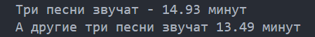
## 07_secret.py
### Условие 
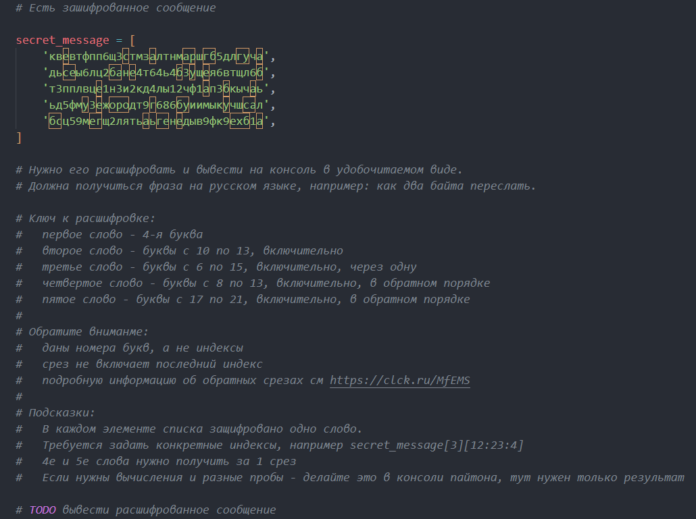
### Алгоритм 
1. Первое слово - нулевая строка, третий символ (по индексу)
2. Второе слово - первая строка, символы с 9 до 12
3. Третье слово - вторая строка, символы с 5 до 13 с шагом 2
4. Четвёртое слово - третья строка, симолы с 7 до 12, зеркально переворачивает слово
5. Пятое слово - четвёртая строка, символы с 16 до 20, зеркальный переворот слова
6. В переменной `biba` записываем получившиеся слова через пробел
7. Выводим результат
### Результат 
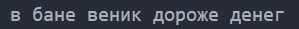
## 08_garden.py
### Условие 
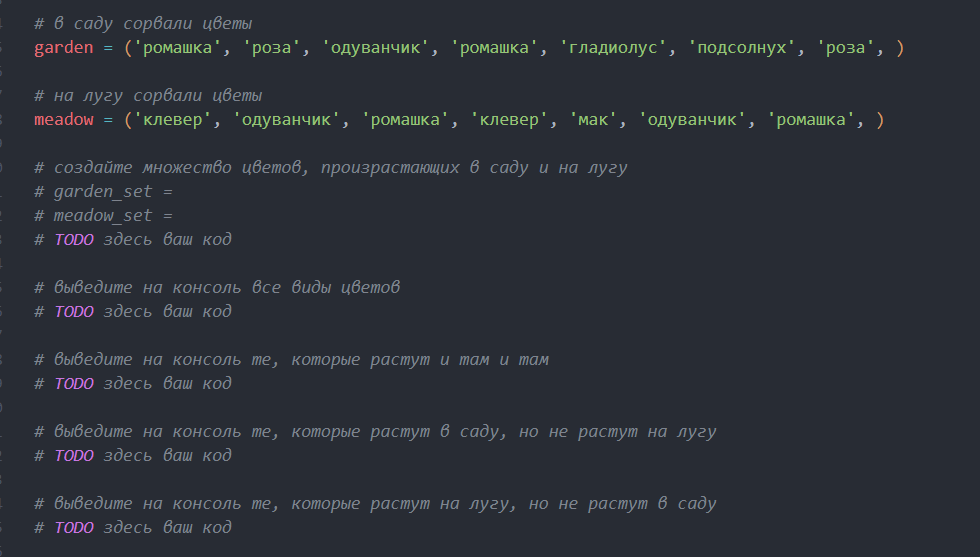
### Алгоритм 
1. Создаём множество с помощью `set`
2. Объединяем множества с помощью `union` для вывода всех видов цветов
3. Цветы, растущие и там и там с помощью `intersection`
4. `difference` для цветов, растущих только в саду, и цветов, растущих только на лугу
### Результат 
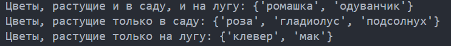
## 09_shopping.py
### Условие
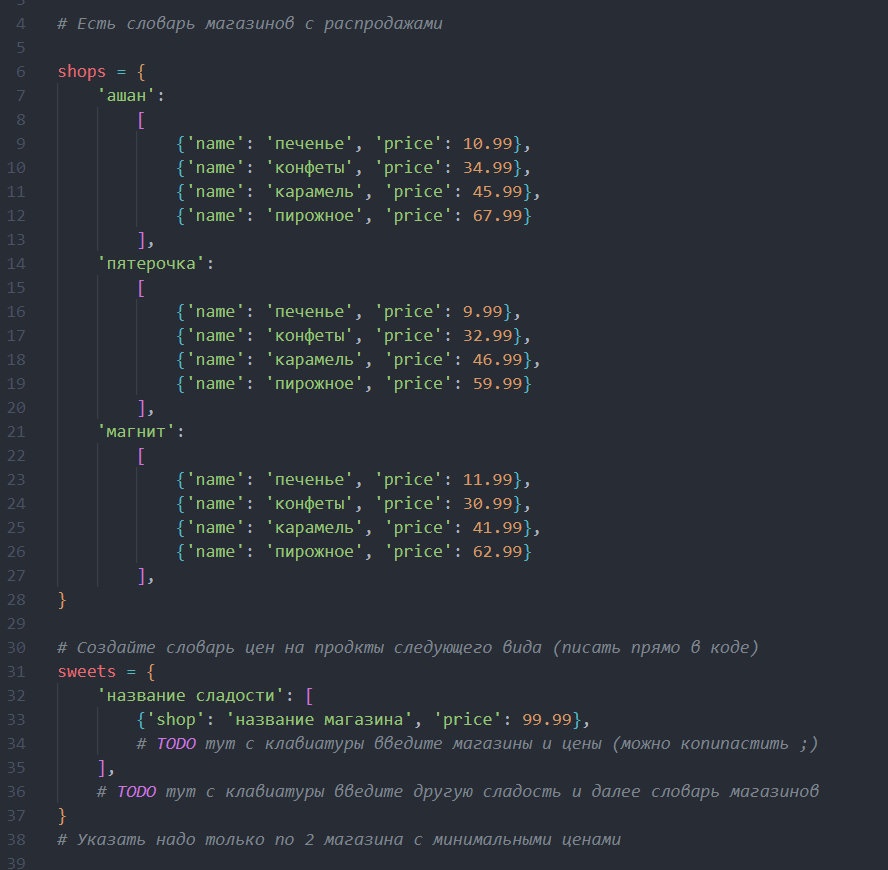
### Алгоритм 
1. Создаём словарь `sweets`
2. Перечисляем в нём сладости
3. Для каждой сладости пишем по 2 магазина с минимальным ценником 
## 10_store.py
### Условие 
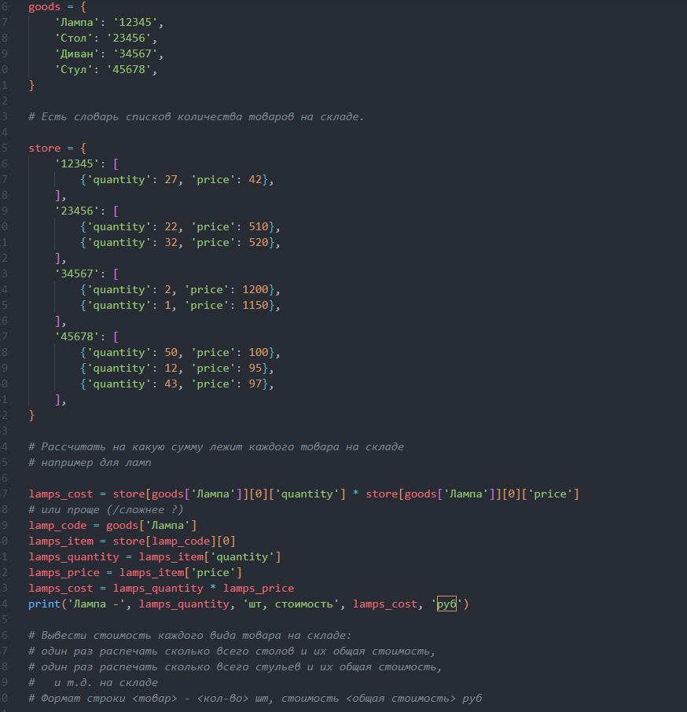
### Алгоритм 
(Для столов)
1. Пишем код товара в `table_code`
2. В `tables_item1`, `tables_item2` характеристики первого и второго вида столов
3. В `tables_quantity1`, `tables_quantity2` количество штук в наличии. В `tables_quantity` общее количество
4. В `tables_price1`, `tables_price2` цену одного и другого видов столов. В `tables_cost` общую сумму всего товара 
5. Выводим количество штук, общую стоимость
6. Делаем тоже самое для оставшихся товаров
### Результат 
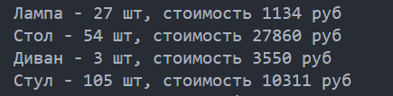