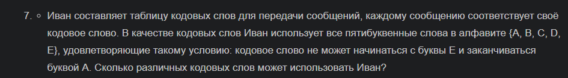
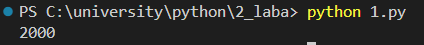
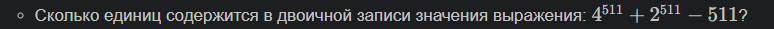
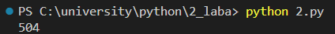
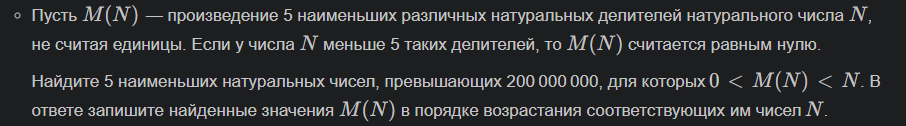
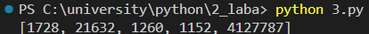

# 2_laba
## Вариант 7
### Задача 1. Условие

### Алгоритм 
1. Импортируем модуль `product` из библиотеки `itertools`
2. Объявляем функцию `first()`, счётчик `cnt`, пустой массив `arr`, алфавит `"ABCDE"`
3. Создаём переменную `biba`, в которой будут меняться местами буквы из нашего алфавита
4. В первом цикле `for` перебираем слова из `biba`, добавляем их в массив `arr`
5. Во втором цикле `for` делаем проверку на условие задачи (кодовое слово не может начинаться с буквы E и заканчиваться буквой A). Если условие выполняется, то увеличиваем счётчик
6. Возвращаем счётчик и принтуем ответ
### Результат

### Задача 2. Условие 

### Алгоритм
1. Объявляем функцию `second()`
2. Создаём переменну `num2`, в которую записываем выражение из условия задачи
3. В переменную `dvoichka` записываем выражение `num2` в двоичной системе счисления. Делаем срез первых 2 символов
4. Возвращаем количество единиц, находящееся в `dvoichka` и принтуем результат
### Результат

### Задача 3. Условие 

### Алгоритм
1. Объявляем функцию `third()`, пустой массив `a`
2. В цикле `for` перебираем значения `x` от 200000001 до 200000100
3. Создаём массив `b`, который будет исключать повторения значений
4. Перебираем значения `n` от 2 (так как исключаем единицу) до квадратного корня числа `x`
5. Проверка на делимость чисел `x` и `n` без остатка. Добавление числа `n` и частного `x//n` в массив `b`
6. Если длина массива `b` больше 5, то сортируем значения в массиве `b`
7. В переменную `mn` записываем умножение элементов массива `b`
8. Если умножение элементов массива `mn` меньше числа `x`, то добавляем `mn` в массив `a`
9. Возвращаем первые 5 элементов массива и принтуем их
### Результат

