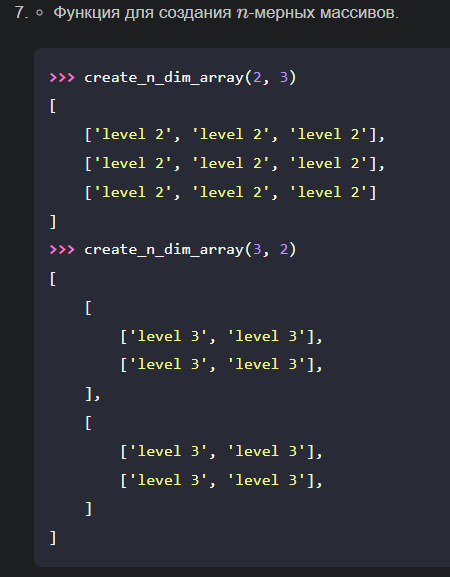
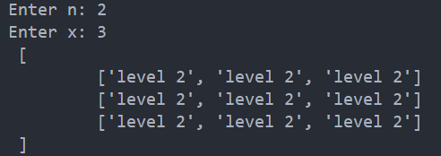
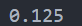

# 3_laba
## 7 вариант 
### Условие 1 задачи 

### Алгоритм (рекурсия)
1. Создаём функцию `create_n_dim_array`, принимающую на вход значения `n`, `x`
2. Если `n <= 1`, то выводим `"\t"*(level-2), [f'level {level - 1}']*x`
3. Иначе выводим скобки с отступами, вызываем рекурсю, при которой `n-1`, a `level + 1`
4. Вызываем функцию. Пусть `n = 2`, `x = 3`
### Результат

### Алгоритм (без рекурсии)
1. Создаём функцию `create_n_dim_array`, принимающую на вход значения `n`, `x`
2. Первый и третий циклы `for` нужны для вывода "внешних" скобок
3. Второй цикл `for` выводит значения `level n` и скобки между ними
4. Вызываем функцию. Пусть `n = 2`, `x = 3`
### Условие 2 задачи

### Алгоритм (рекурсия)
1. Вводим создаём функцию `func`, которая примет на вход значения `x`, `k`
2. Проверяем `x` на положительность
3. Значения `b0 = 1 / (2 * x)` и `y0 = 1` даны по условию
4. Создаём функцию `f`, которая будет считать значаения `yk` и `bk`
5. Функция `b_k` считает значение `bk` через рекурсию
6. Функция `y_k` считает значение `yk` через рекурсию
7. Выводим результат функции при `x = 1` и `k = 3`
### Результат

### Алгоритм (без рекурсии)
1. Вводим создаём функцию `func`, которая примет на вход значения `x`, `k`
2. Проверяем `x` на положительность
3. Значения `b0 = 1 / (2 * x)` и `y0 = 1` даны по условию
4. Создаём цикл, который будет действовать до тех пор, пока `k != 0`
5. Высчитвыаем значения `bk` и `yk`
6. Возвращаем и принтуем результат при `x = 1` и `k = 3`
### Источники 
1. [Цикл for в Python — как работает, синтаксис, примеры](https://pythonchik.ru/osnovy/cikl-for-v-python)
2. [Рекурсия в Pyhton](https://www.codecamp.ru/blog/python-recursion/)
