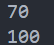

# 7 вариант
## Условие 1 задачи

## Алгоритм
1. __Создаём функцию `decorator`__, которая является декоратором.
2. В это функции создаём обёртку `wrapper`, которая сможет принимать любое количество аргументов.
3. Переменная `result`, в которую записываем принимаемую декоратором функцию
4. Возвращаем результат в диапазоне от 0 до 100
5. Возвращаем `wrapper`
6.  __Создаём функцию `hero`__, перед ней применяя декоратор, отвечающая за героя, инициализируем его текущее `hp = 100`.
7. __Создаём функцию `heal`__, перед ней применяя декоратор, отвечающая за лечение персонажа и принимающая в качестве параметра количество hp, которое будет отхилено.
8. Далее пишется `nonlocal hp` - ключевое слово, которое позволяет присваивать значения переменной во внешней (но не глобальной) области.
9. Хиллим персонажа, не забывая о том, что `hp` должно быть не больше 100.
10. Возвращаем полученное значение `hp`.
11. __Создаём функцию `damage`__, отвечающая за нанесение урона и принимающая в качестве параметра количество hp, которое будет нанесено уроном.
12. Наносим урон персонажу, не забывая о том, что `hp` должно быть не меньше 0.
13. Возвращаем полученное значение `hp`.
14. Возвращаем`heal` и `damage`.
15. Строка `heal, damage = hero()` присваивает возвращаемые функции из замыкания переменным `heal` И `damage`
16. Выводим результат (отнимаем 30 хп и хиллим 40)
## Результат

## Условие 2 задачи 

## Алгоритм
1. Создаём декоратор, а в нём обёртку, которая не будет ничего возвращать.
2. Инициализируем `simple func`, а перед ней используем декоратор
3. Выводим на экран
## Результат

## Источники
1. [#44. Замыкания в Python | Python для начинающих - YouTube](https://www.youtube.com/watch?v=sJF7OMNgLUs)
2. [#45. Введение в декораторы функций | Python для начинающих - YouTube](https://www.youtube.com/watch?v=v0qZPplzwUQ&t=385s)
3. [matlab - Suppressing a function's command window output - Stack Overflow](https://stackoverflow.com/questions/3029636/suppressing-a-functions-command-window-output)
