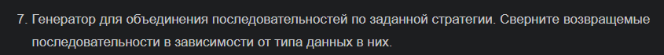

# 7 вариант
## Условие

## Алгоритм
1. Инициализируем `getfunc`, принимающий 2 последовательности и стратегию
2. Далее проверяем последовательности на типы данных (`list`, `str`) и объединяем эти последовательности 
3. Для `i`-тых элементов из `list(map(func, seq1, seq2))` делаем возврат `yield`
4. Функции `f1`, `f2` - стратегии, по которым объединяются последовательности (сложение/умножение)
5. Инициализируем 2 какие-либо последовательности и выводим результат
6. Сворачиваем в последовательности в зависимости от типа данных в них с помощью `reduce`
## Результат

## Список источников 
1. [48 Генераторы и итераторы. Выражения -генераторы в Python - YouTube](https://www.youtube.com/watch?v=vn6bV6BYm7w)
2. [49 Функция генератор. Создание генератора при помощи yield Python - YouTube](https://www.youtube.com/watch?v=8cMMO8fks-k&list=PLQAt0m1f9OHvv2wxPGSCWjgy1qER_FvB6&index=51)
3. [50 Функция map Python. Что делает функция map в Python - YouTube](https://www.youtube.com/watch?v=2ghKShXWuSs&list=PLQAt0m1f9OHvv2wxPGSCWjgy1qER_FvB6&index=52)
4. [Функция reduce в Python](https://pythonist.ru/funkcziya-reduce-v-python/)
