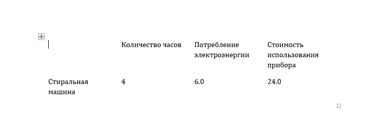

# 7 вариант
## Условие

## Алгоритм
1. `package` - пакет, содержащий 3 модуля. 
- `gui.py` - файл с 3 функциями, которые высчитывают значения потребления электроэнергии и стоимости использования прибора за заданное количество часов. Также отвечает за визуализацию интерфейса
- `docx_save.py` - содержит функцию `docx_save`, которая отвечает за сохранение полученных результатов в виде таблицы в `.docx` файле
- `values.py` - содержит переменные со значениями расхода энергии для каждого прибора в кВт и тарифа в кВт.ч
2. `6.py` - "main" файл, отвечающий за запуск программы и интерфейса
## Результат

## Источники
1. [Урок 12. Модули и пакеты в Python. Файл init.py - YouTube](https://www.youtube.com/watch?v=eVOKYq-ztN8&t=1s)
2. [Toga 0.4.4](https://toga.readthedocs.io/en/stable/index.html)
3. [python-docx — python-docx 1.1.2 documentation](https://python-docx.readthedocs.io/en/latest/index.html)