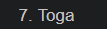
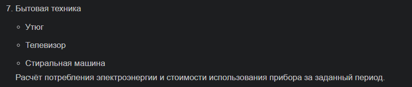
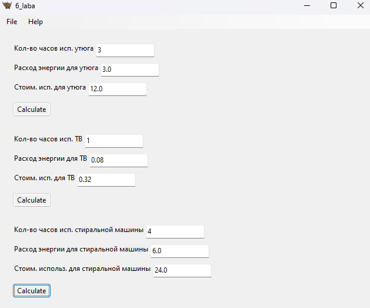

# 7 вариант
## Условие

## Алгоритм
### Про файлы
1. В `package` хранятся модули `iron.py`, `tv.py` и `vashingmachine.py`, в которых реализовывается графический интерфейс для подсчёта расхода электроэнергии и стоимости использования прибора (утюг, телевизор и стиральная машина соответственно)
2. Модуль `values.py` хранит переменные со значением тарифа и расхода энергии для каждого прибора в кВт
3. `6.py` - "main" файл с реализацией запуска программы
### Про модули с реализацией графического интерфейса и расчётами
#### Рассмотрим на примере `iron.py`
1. Импортируем переменные `values` из `package`, импортируем `toga` и `toga.style.pack` для реализации расположения и внешнего вида "окон" с вводом и выводом значений
2. `def iron_func()`- функция с реализацией интерфейса и вычислений электроэнергии, стоимости прибора, на которую в будущем будем ссылаться в `6.py`
3. `iron_calculate_A_box` хранит в себе объединение `iron_calculate_A`, `iron_label_A`.   
4. `iron_calculate_A` - вывод значения расхода энергии для утюга.
`iron_label_A` - лэйбл с надписью "Расход энергии для утюга"
5. `def iron(widget)` - функция с вычислением расхода энергии `iron_calculate_A.value` и вычислением стоимости использования прибора `iron_calculate_C.value`
6. `ironButton` - кнопка для запуска вычисления значений
7. `box1` - "блок",отвечающий за визуализацию для утюга
#### Аналогично для `tv.py` и `vashingmachine.py`
## Результат

## Источники
1. [Урок 12. Модули и пакеты в Python. Файл init.py - YouTube](https://www.youtube.com/watch?v=eVOKYq-ztN8&t=1s)
2. [Toga 0.4.4](https://toga.readthedocs.io/en/stable/index.html)