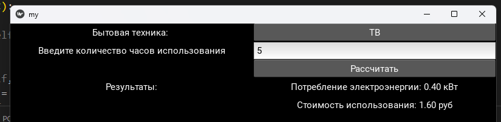
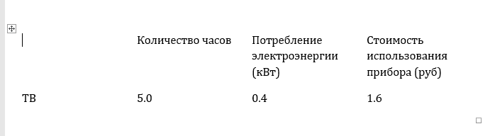

## Условие

## Алгоритм

Пакет `folder` содержит в себе модули:
- `docx_save.py`, отвечающий за сохранение данных в формате `.docx`
- `electrodevices.py`, содержащий в себе класс `Electrodevice`, обозначающий имя и мощность для каждого электроприбора. Содержит `@property`

`7.py`, содержащий 2 класса: 
1. `class Calculator` (абстрактный базовый класс) с абстрактным методом `calculate`
2. `class myApp(App, Calculator)` отвечает за интерфейс (библиотека `kivy`) и работу функций расчёта стоимости использования электроприбора и потребления энергии 

## Результат

## Источники
1. [Welcome to Kivy — Kivy 2.3.0 documentation](https://kivy.org/doc/stable/)
2. [Изучение Python Kivy](https://www.youtube.com/watch?v=a8RXdWeeO9I)
3. [Основы ООП. Создание класса и объекта](https://www.youtube.com/watch?v=gFRa6qVN980)
4. [Dunder-методы в Python: зачем они нужны и что могут](https://tproger.ru/articles/dunder-metody-zachem-oni-nuzhny-i-chto-mogut)
5. [Магические методы в python. Dunder методы - YouTube](https://www.youtube.com/watch?v=hUz5m1SDYaQ)
6. [Managed attributes](https://senjun.ru/courses/python/chapters/python_chapter_0360/)
7. [Работа декоратора @property в Python](https://sky.pro/media/rabota-dekoratora-property-v-python/)
