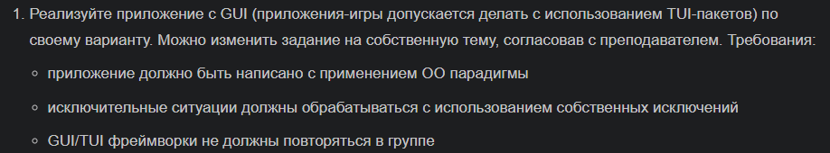
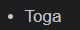
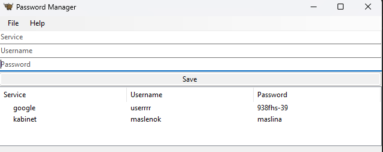

# Менеджер паролей

## Описание

1. `class PasswordManager`, который наследуется от `toga.App`, `MyError` и отвечает за работу менеджера. 
2. `__init__` содержит название приложения и его айди
3. `startup` отвечает за инициализацию интерфеса (создание полей для ввода данных, отображение таблицы, кнопка сохранения)
4. `save_password` сохраняет данные в таблицу. Но если хотя бы одно из полей не будет заполнено, то выйдет ошибка о необходимости заполнения каждого поля
   

## Запуск
1. Запускаем программу
2. Вводим название сервиса, юзернейм и пароль. Если хотя бы одно из полей не будет заполнено, то выйдет ошибка `Service, username, and password are required fields`
3. Нажимаем кнопку `save` и в таблице появляются данные

## Результат

## Источники
1. [Table - Toga 0.4.4](https://toga.readthedocs.io/en/stable/reference/api/widgets/table.html)
2. [PasswordInput - Toga 0.4.4](https://toga.readthedocs.io/en/stable/reference/api/widgets/passwordinput.html)
3. [MainWindow - Toga 0.4.5](https://toga.readthedocs.io/en/latest/reference/api/mainwindow.html)
